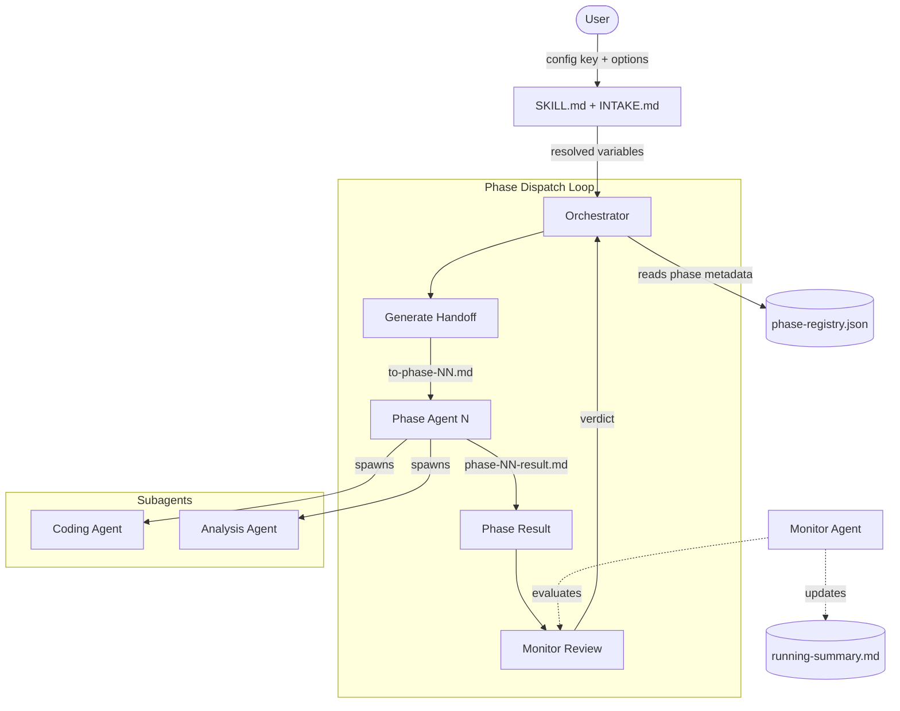

# inference-skill

Standalone distribution repo for the `inferencex-optimize` skill.

This repo packages GPU inference benchmarking, profiling, and kernel optimization workflows as a reusable skill that can be installed once and used from:

- `Claude Code`
- `OpenCode`
- `Cursor`

Claude Code and OpenCode discover skills from Claude-compatible install locations. Cursor uses a generated `.mdc` rule. One `./install.sh` run sets up all three.

## Features

Full InferenceX benchmark, profiling, and kernel optimization workflow with multi-agent orchestration:
- Orchestrator-driven dispatch loop with phase agents
- Quality monitoring with automatic rerun on failure
- Docker container setup and GPU management
- Sweep filtering and configuration
- Benchmark execution and analysis
- Torch profiler trace collection and TraceLens analysis
- GEAK-accelerated kernel optimization
- Framework plugin generation (vLLM, SGLang)
- Report generation

## Architecture

### Multi-agent orchestration

The `inferencex-optimize` skill uses a multi-agent architecture that keeps each agent's context small (~100-200 lines) instead of accumulating the full pipeline (~1,700+ lines) in a single agent.



### Pipeline phases

Each workflow mode maps to a subset of 10 phases:


| Mode | Phases |
|------|--------|
| benchmark | 0 → 1 → 2 → 3 |
| profile | 0 → 1 → 4 → 5 |
| full | 0 → 1 → 2 → 3 → 4 → 5 |
| optimize | 0 → 1 → 2 → 3 → 4 → 5 → 6 → 7 → 8 → 9 |
| optimize-only | 0 → 1 → 6 → 7 → 8 → 9 (requires prior profile artifacts) |

### Token budget

| Component | Context size | What it reads |
|-----------|-------------|---------------|
| Orchestrator | ~500 lines | ORCHESTRATOR.md + registry + current review |
| Phase agent | ~100-200 lines | agent doc + handoff |
| Monitor | ~60-100 lines | monitor doc + summary + result |
| Single-agent (old) | ~1,700+ lines | all phase docs cumulative |

## Guide

For verified OpenCode and Cursor usage, see [GUIDE.md](GUIDE.md).

## Intended UX

```text
Use inferencex-optimize skill for qwen3.5-bf16-mi355x-sglang.
```

The agent should drive a short guided setup:
- first ask exactly three high-level question groups: `Run plan`, `Output`, and `GPUs`
- ask those questions together as one grouped form, not one-by-one
- then do lightweight discovery before asking `tp`, `seq-len`, and `conc`
- offer a smoke fast path with recommended defaults or per-filter review
- emit visible status updates between each stage so the user knows what is happening
- summarize the plan
- start work

## Repo layout

```text
inference-skill/
  install.sh
  LICENSE
  tests/                                # Root-level test shims
  skills/
    inferencex-optimize/
      SKILL.md
      INTAKE.md
      RUNTIME.md
      EXAMPLES.md
      INSTALL.md
      LICENSE
      orchestrator/                     # Multi-agent orchestration
        ORCHESTRATOR.md
        phase-registry.json
        monitor.md
      agents/                           # Self-contained phase agents
        phase-00-env-setup.md ... phase-09-report-generate.md
        coding-agent.md
        analysis-agent.md
      protocols/                        # Communication schemas
        phase-result.schema.md
        monitor-feedback.schema.md
        handoff-format.md
        rerun-protocol.md
        analyzer-manifest.schema.md
      phases/                           # Reference archive (human-readable)
      templates/
      scripts/                          # Organized by category
        env/ container/ profiling/ optimize/ plugin/ report/
      tests/
      resources/
```

## Install

Clone the repo and install globally:

```bash
git clone https://github.com/AMD-AIM/inference-skill.git
cd inference-skill
./install.sh
```

Install into a specific project:

```bash
./install.sh --project /path/to/project
```

Create a linked install for local development:

```bash
./install.sh --project /path/to/project --link
```

## Install targets

Global install writes to:

```text
~/.claude/skills/inferencex-optimize       # skill files (Claude Code + OpenCode)
~/.cursor/skills/inferencex-optimize       # symlink (Cursor native skill)
~/.cursor/rules/inferencex-optimize.mdc    # Cursor agent-requested rule
```

Project install writes to the same three locations under the project directory.

## Source of truth

The skill lives under `skills/inferencex-optimize/`.

This directory is the source of truth:
- `SKILL.md` - skill definition and metadata
- guided intake flow
- runtime defaults and bootstrap rules
- interaction examples
- phase instructions
- helper scripts
- packaged test assets

## E2E test packaging

E2E assets are packaged inside the installed skill directory:

- `~/.claude/skills/inferencex-optimize/tests/E2E_TEST.md`
- `~/.claude/skills/inferencex-optimize/tests/e2e_optimize_test.py`
- `~/.claude/skills/inferencex-optimize/resources/TraceLens-internal.tar.gz`

Repo-level `tests/` paths are kept as compatibility entrypoints and forward to the canonical skill-level copy.

## Development workflow

1. Edit files under `skills/inferencex-optimize/`
2. Reinstall with `./install.sh` or use `--link` during development
3. Validate the installed result from the destination skill directory