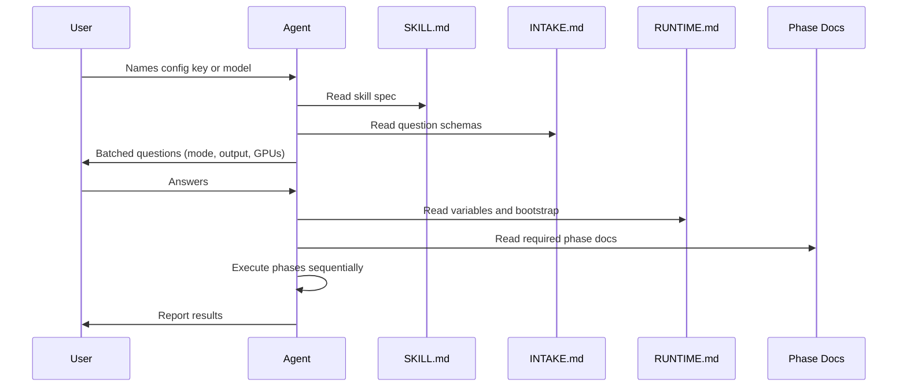
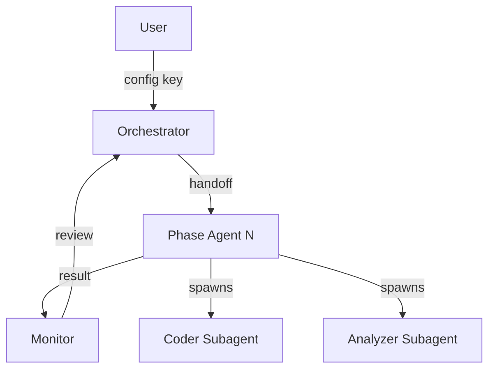

# Inference-Skill Repository Summary

## Overview

The `inference-skill` repo is a **standalone distribution of AI agent skills** for GPU inference benchmarking, profiling, and kernel optimization. It targets three agent platforms: **Claude Code**, **OpenCode**, and **Cursor**. Skills are installed via a single `install.sh` and guide an AI agent through a multi-phase pipeline for evaluating and optimizing inference workloads on AMD (MI355X/MI300X) and NVIDIA GPUs.

---

## Repository Layout

```
inference-skill/
  README.md                  # Product overview, install targets, dev workflow
  GUIDE.md                   # OpenCode/Cursor verification and example prompts
  install.sh                 # Installs both skills to Claude/OpenCode/Cursor
  LICENSE                    # MIT
  .gitignore
  skills/
    inferencex-optimize/     # Primary skill (present in workspace)
      SKILL.md               # Machine-facing skill spec, modes, phase index
      INTAKE.md              # Guided UX question schemas
      RUNTIME.md             # Variables, defaults, bootstrap, guardrails
      INSTALL.md             # Per-skill install verification
      EXAMPLES.md            # Dialogue examples
      LICENSE
      orchestrator/          # Multi-agent orchestration (3 files)
        ORCHESTRATOR.md      #   Dispatch loop, handoff generation, agent spawning
        phase-registry.json  #   Phase metadata, mode maps, quality criteria
        monitor.md           #   Monitor agent template and rules
      agents/                # Self-contained per-phase agents (12 files)
        phase-00-env-setup.md through phase-09-report-generate.md
        coding-agent.md      #   Kernel/plugin coding specialist
        analysis-agent.md    #   Data analysis specialist
      protocols/             # Communication schemas (5 files)
        phase-result.schema.md
        monitor-feedback.schema.md
        handoff-format.md
        rerun-protocol.md
        analyzer-manifest.schema.md
      phases/                # Reference archive (original runbooks, not loaded by agents)
      scripts/               # ~30 Python/shell helpers organized by category
        env/                 #   Config validation, GPU detection, env info
        container/           #   Docker lifecycle management
        profiling/           #   Trace analysis, TraceLens, profiler injection
        optimize/            #   Kernel classification, problem generation, GEAK
        plugin/              #   vLLM/SGLang plugin generation
        report/              #   Optimization validation and summary
      templates/             # Report templates, schema, agent-config
      tests/                 # E2E test runner and runbook
      resources/             # TraceLens tarball
    vllm-optimize/           # Second skill (documented but absent from this checkout)
  tests/                     # Root-level shims delegating to skill-local tests
```

---

## Two Skills

- **inferencex-optimize** -- Full InferenceX pipeline: Docker orchestration, benchmark sweeps, torch profiler traces, TraceLens analysis, kernel optimization (GEAK), plugin generation, and report assembly.
- **vllm-optimize** -- Standalone vLLM benchmark/profiling workflow (documented in README but directory is missing from this checkout).

---

## Workflow Modes and Phase Mapping

The inferencex-optimize skill supports five workflow modes, each mapping to a subset of 10 phases:

```mermaid
flowchart LR
    P0[Phase 0: Env Setup]
    P1[Phase 1: Config Parse]
    P2[Phase 2: Benchmark]
    P3[Phase 3: Bench Analyze]
    P4[Phase 4: Profiling]
    P5[Phase 5: Profile Analyze]
    P6[Phase 6: Problem Gen]
    P7[Phase 7: Kernel Optimize]
    P8[Phase 8: Integration]
    P9[Phase 9: Report Gen]

    P0 --> P1
    P1 --> P2
    P2 --> P3
    P3 --> P4
    P4 --> P5
    P5 --> P6
    P6 --> P7
    P7 --> P8
    P8 --> P9
```



- **benchmark**: P0 -> P1 -> P2 -> P3
- **profile**: P0 -> P1 -> P4 -> P5
- **full** (benchmark+profile): P0 -> P1 -> P2 -> P3 -> P4 -> P5
- **optimize**: P0 -> P1 -> P2 -> P3 -> P4 -> P5 -> P6 -> P7 -> P8 -> P9
- **optimize-only**: P0 -> P1 -> P6 -> P7 -> P8 -> P9 (requires prior profile artifacts)

---

## Phase Descriptions

- **Phase 0 -- Environment Setup**: Checks Docker/GPUs, clones InferenceX repo, validates config key against master YAML, verifies Python/YAML, checks HF cache, installs GEAK if needed, writes `env_info.json`.
- **Phase 1 -- Config Parsing and Sweep Generation**: Re-validates key, runs `generate_sweep_configs.py`, applies TP/EP/sequence/concurrency filters, saves `sweep_configs.json`, resolves benchmark script paths.
- **Phase 2 -- Benchmark Execution**: Groups sweep configs by Docker image, starts persistent container, runs each config via `docker exec` with GPU selection, collects results/traces.
- **Phase 3 -- Benchmark Analysis**: Parses result JSONs, computes derived metrics (per-GPU throughput, interactivity, latency), builds comparison tables, fills `benchmark_report.md`.
- **Phase 4 -- Profiling**: Selects representative configs, starts profiling container, patches rank-0-only tracing, injects profiler settings, runs profiled benchmarks with heartbeats, collects traces.
- **Phase 5 -- Profile Analysis**: Validates traces, runs gap analysis (`trace_analyzer.py`), installs/runs TraceLens with GPU arch for roofline, merges findings into `profile_analysis.json`, writes `profiling_report.md`.
- **Phase 6 -- Problem Generation**: Classifies kernels, extracts model shapes, runs fusion analysis, generates `problem_*.py` files and `optimization_manifest.json` for GEAK.
- **Phase 7 -- Kernel Optimization**: Resolves GEAK mode, loads manifest, starts optimize container, runs GEAK or manual optimization with test/finalize/patch-recovery, collects winning kernels.
- **Phase 8 -- Integration and E2E Benchmarking**: Verifies winning kernels, generates vLLM/SGLang plugins, injects plugin into benchmark script, runs optimized vs baseline benchmarks, validates with `validate_optimization.py`.
- **Phase 9 -- Final Optimization Report**: Gathers all artifacts, fills `optimization_report.md`, generates `optimization_summary.json`, marks workflow complete.

---

## Scripts Inventory (30 helpers)

Key categories:

**Configuration and Validation**
- `validate_config_key.py` -- Verifies config key exists in master YAML
- `detect_gpu_arch.py` -- Detects GPU model, writes peak FLOPS/memory specs
- `generate_env_info.py` -- Writes `env_info.json` from GPU detection + env flags
- `select_gpus.py` -- Picks least-loaded GPU indices for AMD or NVIDIA

**Container Orchestration**
- `start_profile_container.sh` -- Creates GPU-enabled persistent Docker container
- `run_profile_exec.sh` -- Executes benchmark script in container with heartbeats
- `collect_profile_traces.sh` -- Copies traces/results from container to output tree

**Profiling and Analysis**
- `inject_profiler_config.py` -- Injects profiler CLI args into benchmark script
- `patch_rank0_profiling.py` -- Patches so only rank 0 exports profiler traces
- `patch_benchmark_lib.py` -- Disables relay trace staging and prompt capping
- `trace_analyzer.py` -- Parses Chrome-format torch traces for kernel stats and gap analysis
- `validate_traces.py` -- Discovers valid trace files for downstream analysis
- `install_tracelens.sh` -- Installs TraceLens CLI from git or bundled tarball
- `run_tracelens.sh` -- Orchestrates TraceLens roofline report generation
- `display_tracelens_results.sh` -- Console summary of TraceLens CSV outputs

**Kernel Optimization**
- `classify_kernel.py` -- Registry-driven kernel name classifier
- `analyze_fusion_inferencex.py` -- Detects fusion patterns from gap analysis
- `extract_model_shapes.py` -- Builds `model_shapes.json` from TraceLens GEMM data
- `generate_problems_inferencex.py` -- Generates GEAK problem files and manifest
- `load_optimization_manifest.py` -- Filters manifest by GEAK mode/scope
- `resolve_geak_mode.py` -- Maps user GEAK mode to effective mode
- `kernel_test_runner.py` -- Correctness and benchmark testing for optimized kernels
- `kernel_finalize.py` -- Writes best optimized kernel code to final file
- `collect_winning_kernels.py` -- Aggregates winning kernels into `geak_results.json`
- `verify_winning_kernels.py` -- Ensures all winning kernels have corresponding files

**Plugin Generation**
- `generate_vllm_plugin.py` -- Generates vLLM `CustomOp.register_oot()` plugin
- `generate_sglang_plugin.py` -- Generates SGLang monkey-patch plugin
- `inject_plugin.py` -- Patches benchmark script to preload plugin

**Reporting**
- `validate_optimization.py` -- Pairs baseline vs optimized results, writes comparison JSON
- `generate_optimization_summary.py` -- Produces machine-readable optimization summary

---

## Templates

- `agent-config.md` -- Agent persona and Docker/GEAK/integration rules with `{{PLACEHOLDER}}` substitution
- `benchmark_report.md` -- Phase 3 report skeleton (throughput, latency, scaling tables)
- `profiling_report.md` -- Phase 5 report skeleton (traces, utilization, gap analysis, roofline)
- `optimization_report.md` -- Phase 9 report skeleton (E2E speedup, per-kernel results)
- `dispatch_plugin_example.py` -- Reference SGLang dispatch monkey-patch for shape-aware plugins
- `profile_analysis_schema.json` -- JSON schema for `profile_analysis.json` structure

---

## Installation (`install.sh`)

- **Options**: `--project PATH` (project-local install), `--link` (symlink) vs `--copy` (default)
- **Per-skill flow**: Validates required files exist, backs up any existing install to `~/.claude/skills/.skill-backups/<name>/<timestamp>/`, copies or symlinks to `~/.claude/skills/<name>/`
- **Cursor integration**: Creates symlink at `~/.cursor/skills/<name>`, generates `~/.cursor/rules/<name>.mdc` by stripping YAML frontmatter from `SKILL.md` and rewriting relative links to absolute paths

---

## Agent Interaction Flow



---

## Multi-Agent Orchestration (New)

The skill now supports a multi-agent architecture that reduces per-agent context by 3-4x:



### New Components
- `orchestrator/ORCHESTRATOR.md` — Dispatch loop, handoff generation, rerun logic
- `orchestrator/phase-registry.json` — Phase metadata, mode maps, quality criteria
- `orchestrator/monitor.md` — Monitor agent prompt with rolling summary
- `agents/phase-NN-*.md` — 10 self-contained phase agents (~100-200 lines each)
- `agents/coding-agent.md` — Kernel optimization specialist
- `agents/analysis-agent.md` — Data analysis specialist
- `protocols/` — Communication schemas (result, feedback, handoff, rerun, manifest)

### Token Budget
- Orchestrator: ~500 lines (ORCHESTRATOR.md + registry + current review)
- Phase agent: ~100-200 lines (agent doc + handoff)
- Monitor: ~60-100 lines (monitor doc + summary + result)
- vs. old single-agent: ~1,700+ lines cumulative

---

## Dependencies (Not Packaged)

- **Host**: bash, docker, python3, PyYAML
- **InferenceX**: Cloned separately (benchmark configs and scripts)
- **TraceLens**: Bundled as `resources/TraceLens-internal.tar.gz`
- **GEAK** (optional): Cloned + pip-installed; requires API keys for optimization

---

## Testing

- `skills/inferencex-optimize/tests/e2e_optimize_test.py` -- Artifact/log validator with argparse CLI
- `skills/inferencex-optimize/tests/E2E_TEST.md` -- Manual E2E runbook (8x MI350X/MI355X, Docker images, HF cache)
- No pytest/tox/unit-test infrastructure beyond the E2E validator

---
